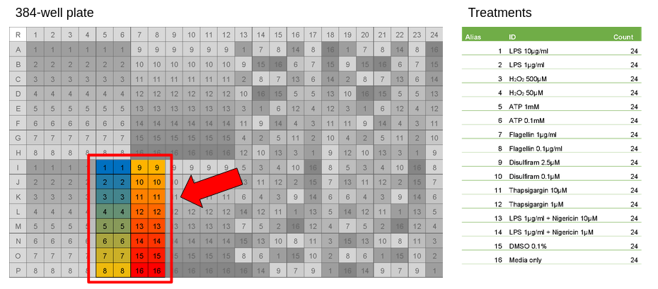

# ASC Bleedthrough Assessment - Wave 2

In this wave of Plate 1 data, we have images from two different conditions with four channels, totalling 4,608 images.

The conditions are as follows:

For **condition 7**:
- HOECHST 33342 -> Nuclei
- Alexa 488 -> ASC Speck
- Mito_641_narrow -> Mitochondria
- Alexa 700_narrow -> Absolute spill over form mito 641

For **condition 8**:
- HOECHST 33342 -> Nuclei
- Alexa 488 -> Nothing/autofluorescence 
- Mito_641_narrow -> Mitochondria
- Alexa 700_narrow -> ASC Speck

Since Alexa 488 and Alexa 700_narrow are staining for different things based on the condition, the metadata for these two channels will include both of the stains per condition (e.g. Alexa 488 = ASC_nothing). 
Since the condition is not included in the metadata `Index.idx.xml` file, it will be added to the final extracted single cell csv file manually.

The treatments that were used in the wave are as follows:

**Note:** The original name of the plate (or collect of wells in a plate) had to be changed due to the inclusion of spaces in the name causing issues downstream.

## Analysis

We use CellProfiler to take measurements (including colocalization, intensity, etc.) to from whole images assess the amount of bleedthrough in the ASC channel from the Mito channel (deep red).
