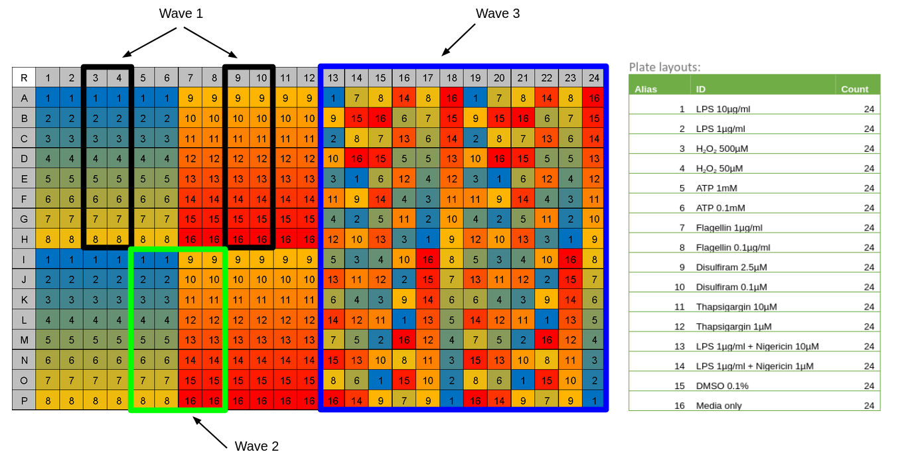

# Pyroptosis signature project 

This repository contains the pipelines used to analyze the "waves" of data for the Interstellar collaboration project.
"Waves" in the context of this repository means different parts of a 384 well plate that contain different stains, conditions, etc.

## Background

[Pyroptosis](https://www.nature.com/articles/nrmicro2070) is inflammatory cell death which occurs in response to pathogens and damage-associated molecular patterns.

## Aims

1. Describe an organelle morphology signature that predicts pyroptosis.
2. Reveal the organelle interaction landscape during pyroptosis at an ultrastructural level.

## The waves for the Interstellar plate 1

Currently, there are three waves of data analyzed coming from one plate.

| Module | Wave title | Description |
| :---- | :----- | :---------- |
| [0.wave1_data](0.wave1_data/) | Nuclei Dilaion Optimization | Using the part of the plate with two channels, Hochest and Gasdermin-D antibody, we perform a CellProfiler pipeline with various nuclei dilation to assess which dilation would allow us to identify the Gasdermin-D around each nuclei when going through pyroptosis. |
| [1.wave2_data](1.wave2_data/) | ASC Bleedthrough Assessment | Using images from two different conditions with four channels, we use CellProfiler to take measurements (including colocalization, intensity, etc.) to assess the amount of bleedthrough in the ASC channel from the Mito channel (deep red). |
| [2.wave3_data](2.wave3_data/) | Cell Painting Assay + Gasdermin-D Channel | A traditional image-based cell analysis pipeline from CellProfiler is used to extract single cell morphology readouts from SHSY-5Y cells. |

## Platemap for plate 1

